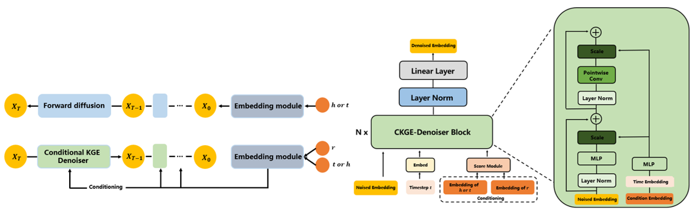

# Capture multiple relation semantics embbeding
Implementation code for the diffusion model to capture multiple relation semantics for knowledge graph embedding.
This paper proposes a knowledge graph embedding diffusion model based on relational multi-semantic modeling. The method assumes that the tail entities corresponding to different semantics follow a certain distribution and employs a conditional diffusion model to learn this distribution.



## Environment Configuration
1、Hardware Requirements: NVIDIA GPU environment required. CUDA version ≥ 12.4, driver version ≥ 550. VRAM requirement ≥ 20GB.

2、Install dependencies: Execute the following command:
``` 
pip install -r requirements.txt
```

## Model Training
The algorithm has encapsulated positive and negative sample sampling processes. To train the embeddings, run: sh scripts/run.sh
```bash
 CUDA_VISIBLE_DEVICES=7 python train_ddpmkge.py --cuda --dataset FB15K-237 --do_train --do_valid --do_test \
  --data_path ../data/FB15K-237  -b 512 -d 400 -g 28 \
  -a 0.5 -adv --modelconfig "../model_configs/Tnet.yaml" \
  -lr 0.00008 --max_steps 250000 --dataset_neg -n 256 \
  -save '../models/FB15K-237-Tnet' --test_batch_size 20 --use_ensemble --pretrain_emb \
  --exp_info "xxxx" 

```

## Model Inference
For trained embeddings, run: sh scripts/eval.sh for inference
```bash
 CUDA_VISIBLE_DEVICES=7 python train_ddpmkge.py --cuda --dataset FB15K-237 --do_test \
  --data_path ../data/FB15K-237  -b 512 -d 400 -g 28 \
  -a 0.5 -adv --modelconfig "../model_configs/Tnet.yaml" \
  -lr 0.00008 --max_steps 250000 --dataset_neg -n 256 \
  -save '../models/FB15K-237-Tnet' --test_batch_size 20 --use_ensemble --pretrain_emb \
  --exp_info "xxxx" 

```

